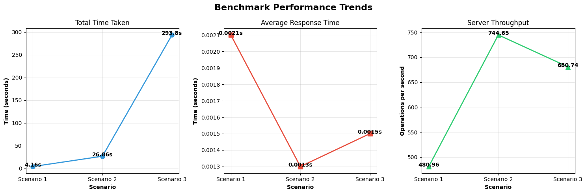

# Performance Report
| Scenario | Total Time | Avg Response Time | Throughput |
|----------|-----------|-------------------|-----------|
| 1 | 4.09s | 0.0020s | 488.42 ops/sec |
| 2 | 22.89s | 0.0011s | 873.57 ops/sec |
| 3 | 243.71s | 0.0012s | 820.64 ops/sec |

As we can see the first scenario where we connect 1 buyers and 1 seller, the throughput is lower than the other scenarios because the limiting factor is how fast can we receive and send data. As for the second scenario where we connect 10 buyers and 10 sellers we see the best numbers in terms of response time and throughput as the server is being utilized more than the first scenario. As for the final scenario where we connect 100 buyers and 100 sellers we lose throughput and the response time lowers bit (0.1ms) this can be attributed to either noise or database connection limits. 