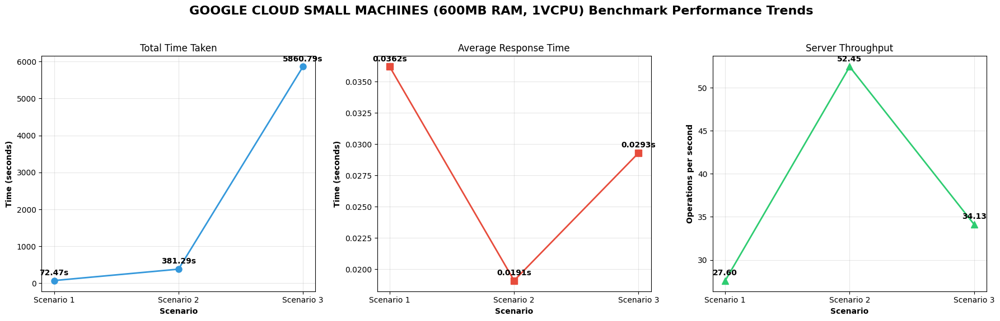

# Performance Report
### 1. Local Environment

| Scenario | Total Time | Avg Response Time | Throughput |
| :--- | :--- | :--- | :--- |
| **0** | 9.79s | 0.0049s | 204.36 ops/sec |
| **1** | 43.67s | 0.0022s | 458.00 ops/sec |
| **2** | 405.70s | 0.0020s | 492.97 ops/sec |

### 2. Google Cloud Small Machines  (2 vCPUs, 1 GB Memory)

| Scenario | Total Time | Avg Response Time | Throughput |
| :--- | :--- | :--- | :--- |
| **0** | 72.47s | 0.0362s | 27.60 ops/sec |
| **1** | 381.29s | 0.0191s | 52.45 ops/sec |
| **2** | 5860.79s | 0.0293s | 34.13 ops/sec |

# TODO: update here
As we can see the first scenario where we connect 1 buyer and 1 seller, the throughput is lower than the other scenarios because the limiting factor is how fast we can receive and send data. In the second scenario where we connect 10 buyers and 10 sellers, we see the best numbers in terms of response time and throughput as the server is being utilized more effectively. In the final scenario where we connect 100 buyers and 100 sellers, we observe a decrease in throughput and a slight increase in response time (0.2ms). This can be attributed to either measurement variance or database connection constraints. 